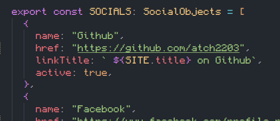

After trying to revive the old blog for 30 minutes, I decided to just migrate to something other than Jekyll, as modifying stuff on it wasn't working.  
I decided to use Astro, and I found some cool templates, eventaully deciding on [this one](https://github.com/satnaing/astro-paper). After importing it and following [this guide](https://docs.astro.build/en/guides/deploy/github/) to set it up with github pages, it's working!

However, deleting all the template stuff and moving the old posts over to the new website is intimidating.

First, I decided to change the homepage at `index.astro`, adding my name and description. I also found where to change the links to socials, and it appears to be a single element that is shared, which is nice.

For some reason, deleting all the posts causes the build to fail, so I'm keeping them until I move my posts over. 

